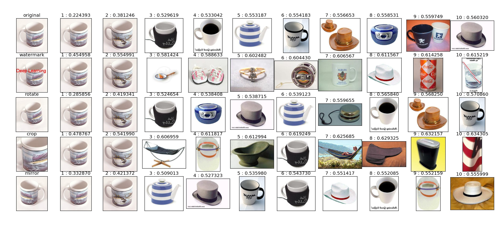

# 炒一锅基于深度学习的图像检索工具
本文介绍如何快速搭建一个基于深度学习的图像检索工具
## 原料
- 数据集: [Caltech256](http://www.vision.caltech.edu/Image_Datasets/Caltech256/) 包含从 Google 图像搜索和PicSearch.com上获得的 30, 607张物体的图像.这些图像通过人工判别被分配在257个类别中. 在这个实验里我们把Caltech256作为我们要检索的图片库. [下载](http://www.vision.caltech.edu/Image_Datasets/Caltech256/256_ObjectCategories.tar)
- 代码: 多伦多大学的老师 Michael Guerzhoy 在[个人网站](http://www.cs.toronto.edu/~guerzhoy/tf_alexnet/)上提供了 AlexNet 的 TensorFlow 实现及权重(weights). 搭建一台能够训练深度学习模型的机器不容易,更不要说训练一个好的模型要花多少时间了, 而有了这个训练好的模型,大家就可以快速的体验深度学习的魅力.
[下载权重(bvlc_alexnet.npy)](http://www.cs.toronto.edu/~guerzhoy/tf_alexnet/bvlc_alexnet.npy)

## 厨具
- 安装Python及相关库(TensorFlow等), 建议安装[Anaconda](https://www.continuum.io/downloads).

## 菜谱
1. 切菜: 修改图像大小
训练的 AlexNet 模型的输入图片的大小是固定的[227, 227],而 Caltech256 中的图片宽高是不固定的. `image_resize.py`可以将某一目录的下的图片批量resize,并保存到另一个目录下. 在终端中敲下`python ./visual_search/tools/image_resize.py -h`查看使用说明.

```
usage: image_resize.py [-h] [--input_data_dir INPUT_DATA_DIR]
                       [--output_data_dir OUTPUT_DATA_DIR] [--width WIDTH]
                       [--height HEIGHT]

optional arguments:
  -h, --help            show this help message and exit
  --input_data_dir INPUT_DATA_DIR
                        Directory to put the input data.
  --output_data_dir OUTPUT_DATA_DIR
                        Directory to put the output data.
  --width WIDTH         Target image width.
  --height HEIGHT       Target image height.
```

2. 开火煮: 提取图像特征
用`visual_search/myalexnet_feature.py`提取图片库中每张图片的特征. 这个脚本会输出两个文件:一个图片的特征,一个是所有图像的完整路径.

```
$ cd visual_search
$ python myalexnet_feature.py -h
usage: myalexnet_feature.py [-h] [--input_data_dir INPUT_DATA_DIR]
                            [--output_feature_file OUTPUT_FEATURE_FILE]
                            [--output_image_name_file OUTPUT_IMAGE_NAME_FILE]

optional arguments:
  -h, --help            show this help message and exit
  --input_data_dir INPUT_DATA_DIR
                        Directory to put the input data.
  --output_feature_file OUTPUT_FEATURE_FILE
                        Output features path.
  --output_image_name_file OUTPUT_IMAGE_NAME_FILE
                        Output image names path.
```


## 上菜
在`visual_search/visual_search.py`脚本里修改图片特征的路径和图像名称的路径可以进行图片检索了. 输入图像可以是本地图片也可以一个图片的链接地址.

```
usage: visual_search.py [-h] [--img_file_path IMG_FILE_PATH]
                        [--img_url IMG_URL]

optional arguments:
  -h, --help            show this help message and exit
  --img_file_path IMG_FILE_PATH
                        Image file path.
  --img_url IMG_URL     Image Url.

```



你会发现有好几行图片,其实每一行都是一个检索记录. 输入图像是每一行的第一张图片. 第2到5行的输入图像是分别对原始图像进行加水印,旋转,裁剪,镜像操作得到.

做这个实验项目其实花了不到一周的业余时间,根据我提供的信息,相信大家可以在很短的时间内做出一套自己的基于深度学习的图像搜索工具.

项目地址: [https://github.com/GYXie/visual-search](https://github.com/GYXie/visual-search)

博客: [炒一锅基于深度学习的图像检索工具](http://gyxie.github.io/2017/02/26/%E7%82%92%E4%B8%80%E9%94%85%E5%9F%BA%E4%BA%8E%E6%B7%B1%E5%BA%A6%E5%AD%A6%E4%B9%A0%E7%9A%84%E5%9B%BE%E5%83%8F%E6%A3%80%E7%B4%A2%E5%B7%A5%E5%85%B7/)

由于时间问题,很多细节没有写,以后会补上.如果有问题,可以在博客下留言.
